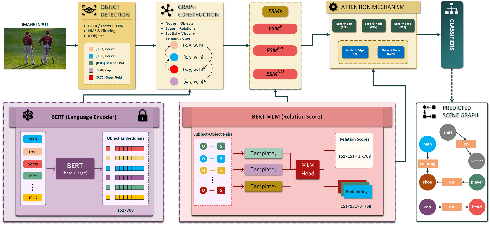

 

# Integrating MLM Scoring and Cross-Attention: A Bridge to Semantic-Aware Scene Graph Generation

## Authors
## Ahmad Reza Jahangard &emsp;&emsp;&emsp;&emsp;  Mohammad Javad Parseh 

 

## Paper

This repository provides the official implementation of our no name.

The method builds upon the Selective Quad Attention (SQUAT) architecture and introduces frozen BERT-based semantic priors to improve robustness under long-tailed predicate distributions.

---

## Overview

We extend SQUAT with three semantic components:

### 1. Object Feature Initialization
Static GloVe embeddings are replaced with contextualized BERT label embeddings via early fusion.

### 2. Semantic Edge Selection (MLM-guided ESM-Q)
Precomputed multi-template masked language modeling (MLM) scores guide query edge selection.

### 3. Edge-to-BERT (E2B) Refinement
A cross-attention module injects continuous semantic embeddings (aggregated MASK hidden states) into edge refinement.

All BERT representations are:
- Precomputed offline
- Fully frozen
- Never updated during training

This preserves architectural modularity while introducing external semantic signals.
for details about extracting semantic priors you can see the code in precomputation directory

---

## Installation

Full environment setup, dataset preparation, and preprocessing instructions are provided in: Installation.ipynb

## Evaluation Settings

We report results on:

- **Predicate Classification (PredCls)**
- **Scene Graph Classification (SGCls)**
- **Scene Graph Detection (SGDet)**

## Results (Visual Genome VG150)

**Metric:** Mean Recall@K (mR@K)

| Setting  | mR@50 | mR@100 | Checkpoint |
|-----------|--------|---------|------------|
| SGDet     | 14.5   | 17.2    | [Download](https://drive.google.com/drive/folders/178BRUzOl-eMd5C5_V_J9bdPPWqnLcEqx?usp=sharing) |
| SGCls     | 17.2   |  19.1   | [Download](https://drive.google.com/drive/folders/1oKBoQ9nlZLUGAtLIQnvzpsGlNqn-OQBs?usp=sharing) |
| PredCls   | 30.5   |  33.2   | [Download](https://drive.google.com/drive/folders/1yuQqto1tmQMu9PQIL5tuAR8iy709wRDM?usp=sharing) |

Improvements are primarily observed in body and tail predicates under SGDet.
